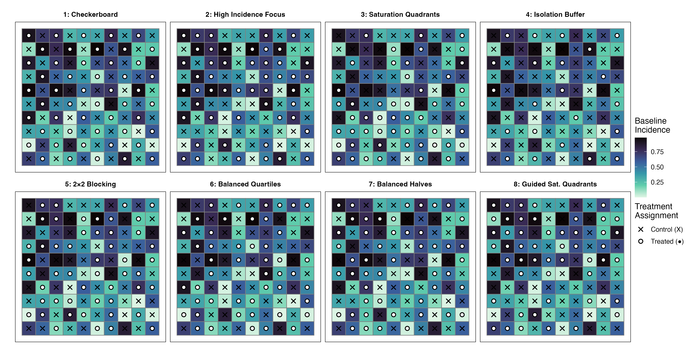

# Modular Incidence Simulation for Spatial CRT Design Evaluation

> For AI session context and quick technical reference, see [CLAUDE.md](CLAUDE.md).

## Overview

This project evaluates which **treatment assignment design** produces the most accurate
estimates of an intervention effect when outcome incidence is spatially heterogeneous
and spillover effects are present. The setting is a Spatial Cluster Randomized Trial
(CRT) on a 10x10 regular lattice grid of 100 clusters.

**Research question:** Across a wide range of spatial dependence, spillover magnitude,
and incidence structures, which of 8 candidate treatment assignment strategies minimizes
estimation error (MSE) and maintains valid inferential coverage?

**Application context:** Sudden Unexpected Death (SUD) in North Carolina counties.
The Poisson incidence mode uses a SUD base rate of 35/100,000 (Mirzaei et al.),
consistent with county-level Poisson analyses by Gan et al. and Watson et al.

---

## Project Lineage

This is a clean-room rewrite of
`archive/OutcomeIncidenceDesign_Legacy/SpatialCRT_Incidence_TreatmentAssignment_Simulation.Rmd`
(~600 lines, monolithic Rmd). Refactoring goals:

1. **Modularity** — numbered R scripts (01-09) that can be run independently or sourced in sequence
2. **Three incidence modes** — Added Spatial (SAR filter) and Poisson modes alongside iid Uniform
3. **Correctness fixes** — Seven specific bugs and design flaws identified and corrected (see below)
4. **Long-run reliability** — Replaced `save.image()` with targeted `saveRDS()`, added per-scenario seeding, ETA logging, and degenerate case handling

The predecessor Rmd is preserved untouched.

---

## File Inventory

| File | Lines | Purpose | Key Functions |
|------|------:|---------|---------------|
| `00_mathematical_specification.Rmd` | ~495 | Theory doc with full LaTeX DGP formulas | (rendered to HTML) |
| `01_spatial_setup.R` | 54 | Regular lattice grid, rook/queen weight matrices | `build_spatial_grid()`, `get_active_spatial()` |
| `02_incidence_generation.R` | 112 | Three incidence generation modes | `generate_incidence()` + 3 mode functions |
| `03_designs.R` | ~162 | Eight treatment assignment strategies | `get_designs()`, `get_design_names()`, `is_design_deterministic()` |
| `04_estimation.R` | 102 | DIM and MLE estimation with CI extraction | `estimate_tau()` |
| `05_run_simulation.R` | ~385 | Main orchestrator, nested parameter loop | `run_incidence_config()` |
| `06_visualizations.R` | ~800 | All plots and summary tables | 18 functions; entry point `run_all_visualizations()` |
| `07_results_summary.Rmd` | ~800 | Rendered results report (HTML/PDF) | Knitted summary of all MLE findings |
| `08_design_recommendations.R` | ~560 | Personalized design recommendations | `run_recommendation_report()`, `table_scenario_lookup()`, `generate_commentary()` |
| `09_MLE_design_recommendation_report.Rmd` | ~984 | Companion narrative PDF report | Knitted to `results/MLE_design_recommendation_report.pdf` |
| `complete_after_mle.R` | ~250 | Post-completion script (viz + docs + stats) | Run once after MLE finishes |

---

## How to Run

### Prerequisites

```r
install.packages(c("spdep", "spatialreg", "dplyr", "tidyr",
                   "digest", "parallel", "ggplot2", "viridis"))
```

### Quick Start — DIM estimation (~5-10 minutes)

```r
# In 05_run_simulation.R, ensure line 40 reads:
#   estimation_mode <- "DIM"

setwd("projects/IncidenceDesign/code")
source("05_run_simulation.R")
```

### Full Run — MLE estimation (~10 hours)

```bash
# Run from terminal to keep process independent of IDE session
# Use caffeinate to prevent sleep on macOS:
#   caffeinate -i -w $(pgrep -f 05_run_simulation) &
cd projects/IncidenceDesign/code
Rscript 05_run_simulation.R
```

In `05_run_simulation.R`, set `estimation_mode <- "MLE"` (line 40).
Optionally set `n_cores > 1` (line 44) for parallel execution across incidence configs.

### Generating Visualizations Only

```r
source("06_visualizations.R")

# All configs, most recent MLE results (primary estimator):
run_all_visualizations(estimation_mode = "MLE_combined")

# Single incidence config with all tables:
r <- load_latest_results(estimation_mode = "MLE_combined")
cfgs <- split_by_incidence_config(r)
run_standard_tables(cfgs[["iid Uniform"]], "iid Uniform")
```

### Generating Design Recommendations

```r
source("08_design_recommendations.R")

# Full recommendation report (PDF + console output):
run_recommendation_report(estimation_mode = "MLE_combined")

# Specific scenario lookup:
r <- load_latest_results(estimation_mode = "MLE_combined")
cfgs <- split_by_incidence_config(r)
table_scenario_lookup(cfgs[["iid Uniform"]], rho = 0.2, gamma = 0.7,
                      spill_type = "both", nb_type = "queen")
```

---

## Simulation Design Summary

**Grid:** 10x10 regular lattice, N = 100 clusters. Two contiguity structures:
rook (4-connected) and queen (8-connected).

**Data Generating Process — Spatial Durbin Model (SDM):**

```
Y = (I - rho*W)^{-1} * [tau*Z + gamma*Spill(Z) + beta*X + epsilon]
```

where tau = 1.0, beta = 1.0, sigma = 1.0, and `Spill(Z)` is the row-standardized
mean treatment of neighbors. Two spillover modes: `control_only` (gamma applied only
to control units) and `both` (applied to all units).

**Incidence modes:**
- **iid Uniform:** X_i ~ Uniform(0,1) independently
- **Spatial:** SAR filter + pnorm transform — spatially correlated but marginally Uniform(0,1)
- **Poisson:** Spatially correlated log-rates -> Poisson counts -> rank-normalized rates in [0,1]

**Treatment designs:** 8 strategies — Checkerboard, High Incidence Focus, Saturation
Quadrants, Isolation Buffer, 2x2 Blocking, Balanced Quartiles, Balanced Halves,
Incidence-Guided Saturation Quadrants.

<p align="center">
  
  <br><em>Sample treatment assignments for each design applied to a single realization of iid Uniform(0,1) baseline incidence. Tile color indicates baseline incidence (darker = higher). Circles = treated, crosses = control.</em>
</p>

**Estimation:** MLE via spatial autoregressive model `lagsarlm(Y ~ Z + Spill + X)` using oracle Spill covariate (250 iterations/scenario).

**Total scenarios:** 5 incidence configs x 2 neighbor types x 4 rho x 4 gamma x 2 spillover types x 8 designs = **2,560 scenarios**

---

## Results Summary

### MLE (full 8-design sweep, completed 2026-03-22)

- **2,560 scenarios** (designs 1–8, all incidence configs) | Fail_Rate = 0.0
- **Best: Design 8 (Incidence-Guided Saturation Quadrants)** MSE=0.079 ≈ **Design 3 (Saturation Quadrants)** MSE=0.080
- **Worst: Design 1 (Checkerboard)** MSE=0.744, coverage ~55%
- Mean coverage ~0.94 for all designs except D1
- File: `results/sim_data/sim_results_MLE_combined_20260322_151030.rds`

### Results Directory Structure

```
results/
  MLE_design_recommendation_report.pdf     # PRIMARY — narrative report (26 pages)
  MLE_combined_design_recommendations.pdf  # PRIMARY — figures/tables PDF (27 pages)
  00_mathematical_specification.pdf        # Theory document
  07_results_summary.pdf                   # Results summary (pending revision)
  sim_data/
    sim_results_MLE_combined_{timestamp}.rds   # All 2,560 MLE scenarios
    sim_results_MLE_iid_{timestamp}.rds        # iid Uniform only (512 rows)
    sim_results_MLE_spatial_{timestamp}.rds    # Spatial only (1,024 rows)
    sim_results_MLE_poisson_{timestamp}.rds    # Poisson only (1,024 rows)
  mle_per_config/
    MLE_combined_{config_name}.pdf             # Per-config 8-plot PDF (5 configs)
    MLE_combined_incidence_overview.pdf        # Incidence heatmaps + distributions
  figures/
    design_samples_8panel.{png,pdf}            # 8-panel design illustration (clean)
    design_samples_option1_overlays.{png,pdf}  # 8-panel with strata/boundary annotations
  archive/
    test_plots.pdf                             # Dev artifacts
    completion_log.txt
```

**Key rule:** Results for iid Uniform, Spatial, and Poisson are always reported
**separately** — never aggregated. The combined .rds exists for loading convenience only.
`load_latest_results()` automatically detects the `sim_data/` subdirectory.

### Paper Directory Structure

```
paper/
  spatialCRT.bib                              # Zotero bibliography export
  SpatialCRT_IncidenceDesign_Presentation.qmd # Presentation slides (scaffold)
  report/
    IncidenceSpatialCRT_Report.qmd            # Unified project report (sources R modules)
    IncidenceSpatialCRT_Report.pdf            # Rendered PDF
    IncidenceSpatialCRT_Report.html           # Rendered HTML
  manuscript/
    IncidenceSpatialCRT_Manuscript.qmd        # Master document (includes child sections)
    _abstract.qmd                             # Structured abstract
    _introduction.qmd                         # Lit review, motivation, aims
    _methods.qmd                              # Spatial structure, SDM, 8 designs, MLE
    _simulation.qmd                           # Parameter space, metrics, results (WIP)
    _application.qmd                          # SUD in NC (skeleton)
    _discussion.qmd                           # Relevance, limitations, future (skeleton)
  section_drafts/                             # Archival LaTeX drafts (Gemini, 6-design era)
    abstract.tex, introduction.tex, methods.tex, simulation.tex
    application.tex, disussion.tex, main.tex
    references.bib                            # Canonical bibliography (113K, Zotero)
    figures/SamplingGridExamples_crop.png
```

The **unified report** (`paper/report/`) consolidates the three code-side reports
(00, 07, 09) into a single end-to-end reference with live R-generated figures and tables.

The **manuscript** (`paper/manuscript/`) uses a modular Quarto structure with
`` directives. Each section is independently editable. The LaTeX
originals in `section_drafts/` are preserved as archival reference.

---

## Key Design Decisions

1. **Incidence generated once per `(mode, rho_X)` config** — not re-drawn per `(nb_type, rho)`.
   In practice a researcher observes historical incidence once; spatial model parameters
   affect outcome propagation, not incidence itself.

2. **Deterministic design detection** — Designs 1 and 2 yield the same assignment for
   every design resample (given fixed incidence). They run once and replicate, saving ~25x compute.

3. **Per-scenario deterministic seeding** — `digest::digest2int(paste(params, sep="|"))` ensures
   reproducibility and order-independence. Adding/removing scenarios doesn't affect others.

4. **Separate reporting by incidence mode** — The three modes represent fundamentally
   different assumptions about prior data. Aggregating across them obscures rather than informs.

5. **Oracle spillover in MLE** — `lagsarlm()` includes the true Spill covariate.
   A `include_spill_covariate = FALSE` toggle exists in `estimate_tau()` for realistic
   estimation comparisons (not yet run systematically).

6. **DIM iteration counts** — Originally planned at 100,000 iterations/scenario; reduced
   to 2,500 (25 design x 100 outcome resamples) for practical runtime.

7. **All 8 designs included** — Design IDs 1–8 are all included in the default
   `design_ids` sweep in `05_run_simulation.R`.

---

## Known Issues & Bugs Fixed

| # | Issue | Root Cause | Fix |
|---|-------|-----------|-----|
| 1 | PDF render failure | `\u03c1` (Unicode rho) unsupported by `pdf()` device | Replace with literal `"rho"` text |
| 2 | Pairwise dominance NaN | `make.names()` mangled column names in `pivot_wider` output | Use `wide[[designs[i]]]` direct bracket access |
| 3 | Eta-squared > 1.0 | `var(group_means)/var(total)` incorrect formula | Proper: `SS_between/SS_total` |
| 4 | `I()` namespace conflict | `I <- diag(N)` shadowed `base::I()` | Renamed to `I_mat` |
| 5 | Degenerate Z crash | Designs occasionally produce all-treated or all-control | Early `NA` return in `estimate_tau()` |
| 6 | R sprintf 10k limit | `complete_after_mle.R` format string too long | Write docs via Claude Code `Write` tool |

---

## Status & Next Steps

**Completed:**
- [x] All code files (00–09) written and tested
- [x] Mathematical specification document (00) rendered to HTML
- [x] DIM simulation: 1,920 scenarios (prior 6-design sweep), visualizations generated (baseline)
- [x] MLE simulation: 1,920 scenarios (prior 6-design sweep), visualizations generated, zero convergence failures
- [x] Design recommendations module (08) with validation tests
- [x] Narrative PDF report (09): `results/MLE_design_recommendation_report.pdf`
- [x] Results directory reorganized: `sim_data/`, `mle_per_config/`, `dim/`, `archive/`
- [x] Project documentation: CLAUDE.md + README.md
- [x] Design set expanded to 8 designs (Balanced Halves, Incidence-Guided Saturation Quadrants added)

**Pending:**
- [x] Re-run MLE simulation: 2,560 scenarios covering all 8 designs (1–8) — completed 2026-03-22
- [x] Unified project report consolidating all code-side reports — completed 2026-03-23
- [x] Modular manuscript framework with converted LaTeX section drafts — completed 2026-03-23
- [ ] Re-run DIM simulation: 2,560 scenarios (baseline, optional — DIM is naive reference only)
- [ ] Regenerate visualizations and design recommendations after re-run

**Manuscript development (in progress):**
- [ ] Populate simulation results section with live R figures/tables
- [ ] Develop Application section (SUD in NC context)
- [ ] Develop Discussion section (relevance, limitations, future work)
- [ ] Careful prose review and revision of all drafted sections
- [ ] Generate updated 8-design grid visualization figure

**Planned simulation extensions:**
- [ ] Revise `07_results_summary.Rmd` — reframe as MLE-focused with DIM as brief baseline footnote
- [ ] Heterogeneous population — Poisson mode with `pop_mode = "heterogeneous"`
- [ ] Non-oracle MLE — run without the true Spill covariate for realistic comparison
- [ ] Grid sensitivity — rerun with `grid_dim = 8` or `grid_dim = 15`

---

## Relationship to SpillSpatialDepSim

IncidenceDesign extends the simulation framework from `projects/SpillSpatialDepSim/`.
SpillSpatialDepSim established the SAR model, spillover mechanics, and block stratification
approach in an applied NC DOC context (8–12 districts). IncidenceDesign asks the same
core design question at larger scale (100 clusters) with systematic variation across
incidence modes and formal design strategies.

---

## References

- Mirzaei, A. et al. (2019). Sudden unexpected death rates.
- Gan, W. et al. (2019). County-level Poisson regression for SUD mortality.
- Watson, K. et al. (AHA). Census tract-level spatial analysis of SUD.
- LeSage, J. & Pace, R.K. (2009). *Introduction to Spatial Econometrics*. CRC Press.
- R packages: `spdep` (Bivand et al.), `spatialreg` (Bivand & Piras), `digest`, `ggplot2`, `viridis`
