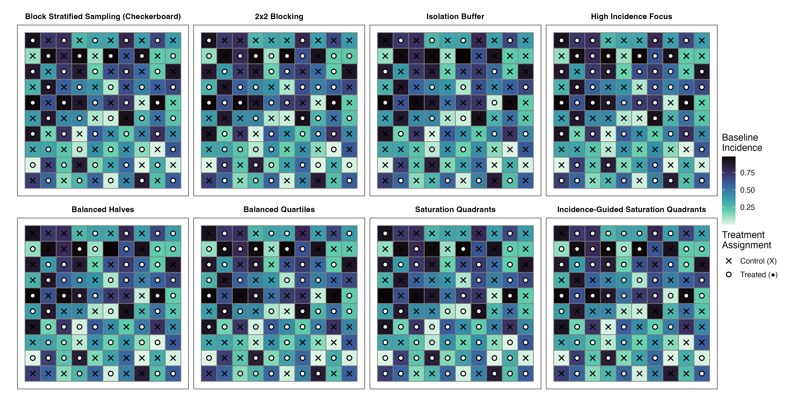

# Modular Incidence Simulation for Spatial CRT Design Evaluation

> For AI session context and quick technical reference, see [AGENTS.md](AGENTS.md).

## Overview

This project evaluates which **treatment assignment design** produces the most accurate
estimates of an intervention effect when outcome incidence is spatially heterogeneous
and spillover effects are present. The setting is a Spatial Cluster Randomized Trial
(CRT) on a 10x10 regular lattice grid of 100 clusters.

**Research question:** Across a wide range of spatial dependence, spillover magnitude,
and incidence structures, which of 8 candidate treatment assignment strategies minimizes
estimation error (MSE) and maintains valid inferential coverage?

**Application context:** Sudden Unexpected Death (SUD) in North Carolina counties.
The Poisson incidence mode uses a SUD base rate of 35/100,000 (Mirzaei et al.),
consistent with county-level Poisson analyses by Gan et al. and Watson et al.

---

## Project Lineage

This is a clean-room rewrite of
`archive/OutcomeIncidenceDesign_Legacy/SpatialCRT_Incidence_TreatmentAssignment_Simulation.Rmd`
(~600 lines, monolithic Rmd). Refactoring goals:

1. **Modularity** — numbered R scripts (01-09) that can be run independently or sourced in sequence
2. **Three incidence modes** — Added Spatial (SAR filter) and Poisson modes alongside iid Uniform
3. **Correctness fixes** — Seven specific bugs and design flaws identified and corrected (see below)
4. **Long-run reliability** — Replaced `save.image()` with targeted `saveRDS()`, added per-scenario seeding, ETA logging, and degenerate case handling

The predecessor Rmd is preserved untouched.

---

## File Inventory

| File | Lines | Purpose | Key Functions |
|------|------:|---------|---------------|
| `00_mathematical_specification.Rmd` | ~495 | Theory doc with full LaTeX DGP formulas | (rendered to HTML) |
| `01_spatial_setup.R` | 54 | Regular lattice grid, rook/queen weight matrices | `build_spatial_grid()`, `get_active_spatial()` |
| `02_incidence_generation.R` | 112 | Three incidence generation modes | `generate_incidence()` + 3 mode functions |
| `03_designs.R` | ~162 | Eight treatment assignment strategies | `get_designs()`, `get_design_names()`, `is_design_deterministic()` |
| `04_estimation.R` | 102 | DIM and MLE estimation with CI extraction | `estimate_tau()` |
| `05_run_simulation.R` | ~385 | Main orchestrator, nested parameter loop | `run_incidence_config()` |
| `06_visualizations.R` | ~800 | All plots and summary tables | 18 functions; entry point `run_all_visualizations()` |
| `07_results_summary.Rmd` | ~800 | Rendered results report (HTML/PDF) | Knitted summary of all MLE findings |
| `08_design_recommendations.R` | ~560 | Personalized design recommendations | `run_recommendation_report()`, `table_scenario_lookup()`, `generate_commentary()` |
| `09_MLE_design_recommendation_report.Rmd` | ~984 | Companion narrative PDF report | Knitted to `results/MLE_design_recommendation_report.pdf` |
| `10_statistical_comparisons.R` | ~1050 | Formal statistical hypothesis tests | `run_friedman_test()`, `run_nemenyi_posthoc()`, `run_pairwise_wilcoxon()`, `run_conditional_tests()`, `plot_cd_diagram()`, `plot_mse_boxplot_with_stars()`, `plot_pvalue_heatmap()` |
| `11_statistical_comparisons_report.qmd` | ~543 | Statistical comparisons narrative report | Rendered to `results/11_statistical_comparisons_report.{html,pdf}` |
| `12_six_design_statistical_comparisons.R` | ~180 | Re-runs Friedman/Nemenyi/Wilcoxon on the 6 manuscript designs, regenerates named-label figures | Outputs to `results/six_design_manuscript/` |
| `13_dissertation_results_extract.R` | ~75 | Pulls per-incidence-mode/per-parameter/robustness numbers for the dissertation chapter | Outputs `results/six_design_manuscript/dissertation_results_extract.txt` |
| `14_manuscript_supplement_figures.R` | ~470 | Fresh 8-design consolidation test (justifies dropping 2 designs) + CTJ Supplementary Information figure suite + reordered/merged main-text figures + application table | Outputs `results/eight_design_supplementary/`, `results/six_design_manuscript/si_figures/` |
| `complete_after_mle.R` | ~250 | Post-completion script (viz + docs + stats) | Run once after MLE finishes |

---

## How to Run

### Prerequisites

```r
install.packages(c("spdep", "spatialreg", "dplyr", "tidyr",
                   "digest", "parallel", "ggplot2", "viridis"))
```

### Running the simulation (2026-09 revision; ~14 minutes on 10 cores)

```bash
cd projects/IncidenceDesign/code
# BLAS must be single-threaded per worker (the runner refuses otherwise):
VECLIB_MAXIMUM_THREADS=1 OPENBLAS_NUM_THREADS=1 OMP_NUM_THREADS=1 Rscript 05_run_simulation.R pilot  # ~1 min
VECLIB_MAXIMUM_THREADS=1 OPENBLAS_NUM_THREADS=1 OMP_NUM_THREADS=1 Rscript 05_run_simulation.R full   # ~14 min
```

- One run fits both estimators (oracle, primary; non-oracle, sensitivity) to the same
  simulated data, and writes them to `results/sim_data/` (`pilot` output goes to
  `results/pilot_rev_2026-09/`).
- Checkpoints are kept per work unit under `results/checkpoints/rev_2026-09/<profile>/`, with
  a manifest. Any change to parameters, code (01–05), packages or BLAS makes the runner
  refuse to resume, so delete that directory to start fresh.
- DIM is not run by the revised script (the DIM baseline in `sim_data/` predates the revision).
- Method specification: `docs/plans/simulation-revision-spec.md`.

### Tests

```bash
VECLIB_MAXIMUM_THREADS=1 OPENBLAS_NUM_THREADS=1 OMP_NUM_THREADS=1 Rscript tests/test_simulation_revision.R
Rscript tests/verify_full_run_rev_2026-09.R
```

- The first runs the design, seeding, aliasing and known-answer tests, plus the ~7-minute
  estimator-equivalence test (`SKIP_EQUIVALENCE=1` skips it).
- The second runs the integrity checks on the latest full run.
- `tests/crosscheck_lagsarlm_rev_2026-09.R` recomputes 1% of the scenarios with `lagsarlm`.

### Generating Visualizations Only

```r
source("06_visualizations.R")

# All configs, most recent MLE results (primary estimator):
run_all_visualizations(results_dir = normalizePath("../results"), estimation_mode = "MLE_tau_sweep")

# Single incidence config with all tables:
r <- load_latest_results(estimation_mode = "MLE_tau_sweep")
cfgs <- split_by_incidence_config(r)
run_standard_tables(cfgs[["iid Uniform"]], "iid Uniform")
```

### Generating Design Recommendations

```r
source("08_design_recommendations.R")

# Full recommendation report (PDF + console output):
run_recommendation_report(estimation_mode = "MLE_tau_sweep")

# Specific scenario lookup:
r <- load_latest_results(estimation_mode = "MLE_tau_sweep")
cfgs <- split_by_incidence_config(r)
table_scenario_lookup(cfgs[["iid Uniform"]], rho = 0.2, gamma = 0.7,
                      spill_type = "both", nb_type = "queen")
```

---

## Simulation Design Summary

**Grid:** 10x10 regular lattice, N = 100 clusters. Two contiguity structures:
rook (4-connected) and queen (8-connected).

**Data Generating Process — Spatial Durbin Model (SDM):**

```
Y = (I - rho*W)^{-1} * [tau*Z + gamma*Spill(Z) + beta*X + epsilon]
```

where beta = 1.0, sigma = 1.0, and `Spill(Z)` is the row-standardized mean treatment of
neighbors. Two spillover modes: `control_only` (gamma applied only to control units) and
`both` (applied to all units). (Despite the historical "SDM" label, only treatment is
spatially lagged.)

**Monte Carlo structure (2026-09 revision):** K = 10 incidence surfaces per config ×
J = 25 design draws per surface = 250 fits per scenario. The design for surface k is drawn
from X_k, the outcome and analysis use the same X_k, and every fit has its own noise draw.
All draws are seeded from keys.

**Incidence modes:**
- **iid Uniform:** X_i ~ Uniform(0,1) independently
- **Spatial:** SAR filter + pnorm transform — spatially correlated but marginally Uniform(0,1)
- **Poisson:** Spatially correlated log-rates -> Poisson counts (100,000 people per cluster, ≈35 expected deaths) -> rank-normalized rates in [0,1]

**Treatment designs:** 8 strategies — Checkerboard, High Incidence Focus, Saturation
Quadrants, Isolation Buffer, 2x2 Blocking, Balanced Quartiles, Balanced Halves,
Incidence-Guided Saturation Quadrants.

<p align="center">
  
  <br><em>Sample treatment assignments for each design applied to a single realization of iid Uniform(0,1) baseline incidence. Tile color indicates baseline incidence (darker = higher). Circles = treated, crosses = control.</em>
</p>

**Estimation:** ML spatial-lag model, oracle `Y ~ Z + Spill + X` (primary) and non-oracle `Y ~ Z + X` (sensitivity), fit with `fit_sar_lag()`. That's the same estimator as `spatialreg::lagsarlm(method = "eigen")` (validated to ~1e-7 on 5,120 fits) at ~120× the speed, since `lagsarlm` spends ~94% of its time in a `gc()` call.

**True tau (tau-sweep):** τ ∈ {0.8, 1.0, 1.5, 2.0, 3.0} — swept to assess design robustness across effect sizes and estimate power curves.

**Total scenarios:** 5 tau × 5 incidence configs × 2 neighbor types × 4 rho × 4 gamma × 2 spillover types × 8 designs = **12,800 scenarios**
(× 250 fits × 2 estimators = 6.4M fits in the 2026-09 run)

---

## Results Summary

### Revised simulation (COMPLETE — 2026-09-24, 12,800 scenarios × 2 estimators)

The results for oracle, τ = 1 and the 6 manuscript designs are below; `results/six_design_manuscript/`
has the full detail.

| Design | Queen MSE | Rook MSE |
|---|---|---|
| Incidence-Guided Saturation Quadrants | 0.091 | 0.072 |
| Balanced Quartiles | 0.131 | 0.084 |
| Isolation Buffer | 0.160 | 0.133 |
| High Incidence Focus | 0.245 | 0.206 |
| 2x2 Blocking | 0.319 | 0.128 |
| Checkerboard | 1.087 | 0.480 |

- **Coverage** is ≈0.94 for every design except Checkerboard × rook, which is 0.15 because τ is not
  identified when WZ = 1 − Z. Those estimates are kept but flagged. Coverage doesn't separate
  the designs; MSE does.
- **Across τ:** under queen the rank order is the same at every τ (Friedman χ² 377–456, all
  p < 2e-16). Per-τ tests share draws, so they aren't independent confirmations. Under
  rook, 2x2 Blocking and Isolation Buffer swap at τ = 0.8.
- **Robustness:** every adjacent pair differs significantly on 50 independent (config × surface)
  units.
- **Consolidation:** Saturation Quadrants and Balanced Halves are statistically indistinguishable
  from Incidence-Guided Saturation Quadrants and Balanced Quartiles, which is why the
  manuscripts carry 6 designs.
- **Non-oracle sensitivity:** bias −0.12 to −0.40 and coverage 0.51–0.90 for every design. It also
  has lower variance where Z and WZ are collinear (queen Checkerboard MSE 1.09 → 0.11).
- **Integrity** (`results/sim_data/full_run_verification.txt`): N_Valid_Est = 250 everywhere and
  zero non-aliasing warnings. Aliasing occurs only in Checkerboard × rook, plus 20 Isolation
  Buffer × rook scenarios that each drew the exact checkerboard once.

### Superseded (April 2026)

The April tau-sweep and March baseline results (e.g. "D8 MSE 0.079, D1 0.802") rest on the
implementation oversights fixed by the revision. They're archived in
`results/archive/pre_revision_20260924/` (see its README) and must not be cited. **The CTJ
manuscript and SI still carry those numbers** until they're rewritten (manuscript plan step 5).

### Results Directory Structure

```
results/
  MLE_tau_sweep_design_recommendations_{queen,rook}.pdf  # 08 figures/tables PDF (oracle, per neighbor type)
  MLE_tau_sweep_incidence_overview.pdf        # Incidence heatmaps + distributions
  MLE_statistical_comparisons.pdf             # 10 figures (8 designs, tau = 1)
  00/07/09/11 rendered reports                # regenerated in Phase C
  sim_data/
    sim_results_MLE_tau_sweep_combined_20260924_025509.rds         # PRIMARY (oracle), 12,800 rows
    sim_results_MLEnonoracle_tau_sweep_combined_20260924_025509.rds # non-oracle sensitivity
    sim_results_*_{iid,spatial,poisson}_20260924_025509.rds          # per-mode splits
    surface_results_*_20260924_025509.rds     # one row per (scenario, surface)
    warnings_*_20260924_025509.csv            # non-aliasing warnings (none)
    run_info_20260924_025509.rds              # manifest, parameters, sessionInfo
    full_run_verification.txt
    sim_results_DIM_*_20260304_195321.rds     # pre-revision DIM baseline (not re-run)
  six_design_manuscript/                      # 12 (oracle), 13, 14: summaries + queen/ and rook/ figures
  six_design_manuscript_nonoracle/            # 12 (non-oracle)
  eight_design_supplementary/                 # 14(a) consolidation check
  estimator_validation/                       # fit_sar_lag vs lagsarlm (5,120 fits) + 1% full-run cross-check
  pilot_rev_2026-09/                          # B4 pilot outputs + pilot_report.txt
  mle_per_config/                             # 06 per-config PDFs
  figures/design_samples_8panel.{png,pdf}
  archive/pre_revision_20260924/              # everything from the April runs
  checkpoints/rev_2026-09/                    # (git-ignored) manifest-checked unit checkpoints
```

**Key rule:** Results for iid Uniform, Spatial, and Poisson, and for rook and queen, are
reported **separately**; pooled numbers appear only when labeled as pooled. The combined .rds exists for loading convenience only.
`load_latest_results()` automatically detects the `sim_data/` subdirectory.

### Paper Directory Structure

> **Note:** the modular Quarto manuscript framework described in earlier versions of
> this README (`paper/manuscript/` with `_abstract.qmd`/`_methods.qmd`/etc. child
> sections) was retired 2026-07-02 in favor of two manuscripts written fresh from
> scratch (see below). That structure is preserved read-only as `paper/archive_manuscript/`
> for reference/fact-checking only.

```
paper/
  SpatialCRT_IncidenceDesign.bib              # Single bibliography shared by both manuscripts
  SAGE_Journal_Template/                      # sagej.cls, SageH.bst, SageV.bst (CTJ render dependency)
  SpatialCRT_IncidenceDesign_Presentation.qmd # Presentation slides (scaffold)
  report/
    IncidenceSpatialCRT_Report.qmd            # Unified project report (sources R modules)
    IncidenceSpatialCRT_Report.pdf            # Rendered PDF
    IncidenceDesign_ProjectSummary.qmd        # Brief project summary report (ranked figures)
    IncidenceDesign_ProjectSummary.pdf        # Rendered PDF summary
  ctj_manuscript/                             # PRIMARY — Clinical Trials (SAGE) submission draft
    CTJ_Manuscript.{tex,pdf}                  # 6-design main text, exactly 6 exhibits (journal cap)
    Supplementary_Information.{tex,pdf}       # SI: reproducibility, full 8-design comparison,
                                               #   metric formulas, per-parameter sensitivity,
                                               #   NC application maps + table (S1-S11)
    figures/                                  # Main-text + SI figures (incl. application_maps/,
                                               #   si_figures/ subdirectories)
  dissertation_chapter/                       # Longer-form chapter, 6 designs, no length ceiling
    Dissertation_Chapter.{qmd,pdf}
    shared-refs.bib -> ../SpatialCRT_IncidenceDesign.bib  # symlink (Quarto underscore workaround)
  archive_manuscript/                         # Retired modular-Quarto manuscript (reference only)
```

The **unified report** (`paper/report/`) consolidates all code-side reports into a single
end-to-end reference (50+ pages): spatial setup, DGP, 8 design illustrations, estimation
methods, simulation design, all MLE results, full statistical comparisons (Section 10 with
Friedman/Nemenyi/Wilcoxon tests and conditional CD diagrams), and design recommendations.

The **project summary report** (`paper/report/IncidenceDesign_ProjectSummary.{qmd,html,pdf}`)
is a shorter companion document with the ranked-figure suite (clean CD diagrams, bias-variance
decomposition, rank/MSE heatmaps) that the CTJ manuscript and its SI figures were adapted from.

The **CTJ manuscript** (`paper/ctj_manuscript/`) is the primary submission target: a short
draft for *Clinical Trials* (SAGE), 6 designs, exactly 6 exhibits (the journal's cap), with
a companion Supplementary Information document covering everything the main text defers to
"online supplementary material" (full parameter grid, metric formulas, the complete 8-design
comparison, and per-parameter sensitivity detail) — see `code/14_manuscript_supplement_figures.R`
for how its figures/tables are generated.

The **dissertation chapter** (`paper/dissertation_chapter/`) is a longer-form version with no
length ceiling and a fuller Results section, sharing the same bibliography and verified facts
as the CTJ manuscript but not its prose.

Figures available in `paper/ctj_manuscript/figures/`:
- `fig_mse_by_design_6design.pdf` — main-text Figure 1, designs ordered best-to-worst
- `fig_biasvar_6design.pdf` — ranked bias-variance decomposition (Figure 2)
- `fig_coverage_tau_6design.pdf` — combined coverage + tau-sensitivity 2-panel figure (Figure 3)
- `application_maps/` — the 3 NC application maps (service-area clusters, synthetic incidence
  surface, k-means saturation regions), used in the main text (Figure 4) and SI (Figures S8-S10)
  — **currently a placeholder, pending the real SUDDEN-derived county dataset**
- `si_figures/` — the SI-only figure suite (CD diagrams, heatmaps, two-panel, tau lines)

---

## Key Design Decisions

1. **Incidence surfaces generated once per `(mode, rho_X, k)`** and shared by every block of
   the config. Spatial model parameters affect outcome propagation, not incidence itself.

2. **Matched surfaces (2026-09):** each design draw is built from the same incidence surface
   the outcome and analysis use. The pre-revision code built designs from surface 1 but
   analyzed surface k.

3. **Key-based seeding** — every draw of X, Z and ε is seeded from a key with fixed RNG
   kinds, so results are identical sequentially, in parallel and in any order.

4. **Separate reporting by incidence mode and neighbor type** — queen is primary, rook the
   sensitivity case; pooling only when labeled.

5. **Oracle spillover in MLE** — the primary model includes the true Spill covariate. The
   non-oracle model (`Y ~ Z + X`) is fit to the same data as a sensitivity analysis.

6. **DIM iteration counts** — Originally planned at 100,000 iterations/scenario; reduced
   to 2,500 (25 design x 100 outcome resamples) for practical runtime.

7. **All 8 designs included** — Design IDs 1–8 are all included in the default
   `design_ids` sweep in `05_run_simulation.R`.

---

## Known Issues & Bugs Fixed

| # | Issue | Root Cause | Fix |
|---|-------|-----------|-----|
| 1 | PDF render failure | `\u03c1` (Unicode rho) unsupported by `pdf()` device | Replace with literal `"rho"` text |
| 2 | Pairwise dominance NaN | `make.names()` mangled column names in `pivot_wider` output | Use `wide[[designs[i]]]` direct bracket access |
| 3 | Eta-squared > 1.0 | `var(group_means)/var(total)` incorrect formula | Proper: `SS_between/SS_total` |
| 4 | `I()` namespace conflict | `I <- diag(N)` shadowed `base::I()` | Renamed to `I_mat` |
| 5 | Degenerate Z crash | Designs occasionally produce all-treated or all-control | Early `NA` return in `estimate_tau()` |
| 6 | R sprintf 10k limit | `complete_after_mle.R` format string too long | Write docs via Claude Code `Write` tool |

---

## Status & Next Steps

**Completed:**
- [x] **2026-09-24: simulation revision (step 0.5)** — spec, M1–M8 code changes, tests, pilot, full re-run, downstream code (12–14, 06, 08) and outputs regenerated; April outputs archived
- [x] All code files (00–11) written and tested
- [x] Mathematical specification document (00) rendered to HTML
- [x] DIM simulation: 1,920 scenarios (prior 6-design sweep), visualizations generated (baseline)
- [x] MLE simulation: 1,920 scenarios (prior 6-design sweep), visualizations generated, zero convergence failures
- [x] Design recommendations module (08) with validation tests
- [x] Narrative PDF report (09): `results/MLE_design_recommendation_report.pdf`
- [x] Results directory reorganized: `sim_data/`, `mle_per_config/`, `dim/`, `archive/`
- [x] Project documentation: AGENTS.md + README.md
- [x] Design set expanded to 8 designs (Balanced Halves, Incidence-Guided Saturation Quadrants added)
- [x] Re-run MLE simulation: 2,560 scenarios covering all 8 designs (1–8) — completed 2026-03-22
- [x] Unified project report consolidating all code-side reports — completed 2026-03-23
- [x] Modular manuscript framework with converted LaTeX section drafts — completed 2026-03-23
- [x] Statistical comparisons module (10) + report (11): Friedman/Nemenyi/Wilcoxon tests — completed 2026-03-25
- [x] Comprehensive report (`paper/report/`) expanded with full statistical section, design figures
- [x] **Tau-sweep simulation: 12,800 scenarios across τ ∈ {0.8, 1.0, 1.5, 2.0, 3.0}** — completed 2026-04-08
- [x] Power metric added (P(reject H₀: τ=0)) and Monte Carlo SEs via delta-method (N_Valid_Est, SE_MSE)
- [x] All reports regenerated with tau sensitivity sections (MSE vs τ, power curves, coverage, rank stability)
- [x] Statistical comparisons updated for tau-sweep; conditional Friedman/Nemenyi across all τ levels
- [x] Pre-sweep deliverables archived: `results/archive/pre_tau_sweep_20260408/`
- [x] **Two manuscripts drafted (first full pass): a short *Clinical Trials* (SAGE)
      submission and a longer-form dissertation chapter** — completed 2026-07-02.
      Both written fresh, sharing a bibliography (`paper/IncidenceDesign_shared.bib`)
      but not prose files. Both present 6 designs (dropping Saturation Quadrants and
      Balanced Halves as statistically redundant), have no DIM-vs-MLE comparison
      anywhere, and use full design names throughout (no numbered shorthand). See
      `paper/ctj_manuscript/` and `paper/dissertation_chapter/`. Application-section
      numbers are an explicitly labeled simulated placeholder pending real
      SUDDEN-derived NC county data (in progress with an epidemiology collaborator).
- [x] **CTJ Supplementary Information drafted and reviewed** — completed 2026-07-03.
      `paper/ctj_manuscript/Supplementary_Information.tex` (14+ pages, S-prefixed
      numbering) fulfills the three items the main text defers to "online
      supplementary material": reproducibility/seeding/code (S1-S2), metric
      formulas + estimation model (S3-S4), the full 8-design table (S5), and the
      complete eight-design comparison (S6) — the only 8-design section anywhere.
      Sections S7-S11 cover per-incidence-mode rankings, parameter/tau sensitivity,
      robustness/win-rate, and an application-scale illustration for the 6 retained
      designs. Generated by new `code/14_manuscript_supplement_figures.R`, which
      also produced a reordered (best-to-worst) main-text MSE figure and a new
      ranked bias-variance figure. Reviewed by a fresh agent against the plan's
      hard constraints (6-design scope, no DIM comparison, no shorthand, numeric
      accuracy, S-numbering) — one gap found and fixed.
- [x] **NC application maps added to both documents** — completed 2026-07-03. The
      three maps already produced by `application/` (58-cluster service-area map,
      synthetic placeholder incidence surface, k-means saturation regions) were
      added to SI Section S11 (Figures S8-S10) and the incidence map alone to the
      main text's Application section (Figure 4), to visually motivate the study.
      To stay within the CTJ's 6-exhibit cap, the separate coverage and
      tau-sensitivity figures were merged into one 2-panel figure. **Open:** a
      deliberate review of the full main-text + SI figure list (this was a quick
      fit, not a considered final selection) — see Open To-Dos below.
- [x] **Real-data ingestion pipeline built and ready** — completed 2026-09-04.
      `application/code/run_application_profiles.R` now has `load_real_sud_data()`,
      `integrate_real_sud_data()`, and `run_all_real_years()` to read, clean, and
      aggregate the real county-level SUD data onto the 58 community-college
      clusters once it arrives, writing to a separate `real_{year}_{profile}/`
      output directory so the existing synthetic results are untouched. **Nothing
      has been run yet** — this is dormant plumbing waiting on the actual dataset;
      see Open To-Dos below for the two key next steps.
- [x] **Real SUD data aggregated to the 58 clusters**, completed 2026-09-25.
      `application/code/run_sud_aggregation.R` joins Habib's methodology death
      counts (`sudden_county_year.csv`, 21,147 deaths) to SEER `pop_18_64`
      (`final_county_sudden.csv`) and writes county- and cluster-level rates per 100,000
      by year, total, and average to the gitignored `application/data/derived/`. It
      reproduces Habib (2026) exactly (see `application/README.md`), and the tests pass (`application/tests/test_application_data.R`).
      The design comparison on these surfaces has not been run yet.

---

## Open To-Dos / Future Work Roadmap

The core simulation is complete. The following extensions would strengthen the study:

### Simulation Extensions

| Priority | Extension | Description | Notes |
|----------|-----------|-------------|-------|
| High | **Non-oracle MLE** | Re-run MLE without true Spill covariate (`include_spill_covariate = FALSE`) | Toggle already exists in `estimate_tau()`; reveals realistic vs. oracle performance gap |
| Medium | **Heterogeneous population** | Poisson mode with `pop_mode = "heterogeneous"` (unequal cluster sizes) | `pop_mode` parameter exists in `05`; needs `generate_incidence_poisson()` extension |
| Medium | **Grid sensitivity** | Rerun with `grid_dim = 8` (64 clusters) or `grid_dim = 15` (225 clusters) | Tests whether D3/D8 dominance holds at different spatial scales |
| Low | **DIM tau-sweep** | Re-run DIM across τ ∈ {0.8, 1.0, 1.5, 2.0, 3.0} to compute DIM power curves | Low priority — DIM is confirmed naive baseline; MLE results are primary |
| Low | **Heterogeneous beta** | Vary `beta` (incidence coefficient) across incidence modes | Would test robustness to signal strength of incidence covariate |

### Manuscript Development

Both manuscripts (`paper/ctj_manuscript/`, `paper/dissertation_chapter/`), plus the CTJ
Supplementary Information, now have complete first drafts — see Status & Next Steps
above. Remaining work:

| Priority | Task | Description |
|----------|------|-------------|
| **NEXT UP** | **Plan the application simulation study** | Paused 2026-09-25, not started. The real data are aggregated (`application/data/derived/`) and the queen/rook weights are built (`application/data/nc_cluster_weights.rds`). To do: plan and run the design comparison on the four yearly surfaces on the revised engine, then replace the placeholder Application-section numbers *and* maps in both manuscripts |
| **High** | **Write, revise, and submit the manuscript(s)** | With explicit consideration for how this material gets reused in the user's **preliminary oral exam** (literature review & project proposal) and **final thesis** (as a thesis chapter) — not scoped to journal submission alone |
| High | **Consolidated review** | Bring all three documents (CTJ main text, CTJ SI, dissertation chapter) to the user for one combined review/revision cycle |
| High | **Figure list review** | Deliberately review the full main-text + SI figure list and decide what to keep/drop/combine — the 2026-07-03 coverage+tau merge was a quick fit to make room for the new NC incidence map, not a considered final selection |
| Medium | **UNC dissertation template** | Reformat `Dissertation_Chapter.qmd` to the UNC Graduate School template once all dissertation chapters are ready to merge (currently a simple double-spaced format matching Project 1's manuscript, per user direction) |
| Medium | **CD diagram bug** | `plot_cd_diagram()` in `10_statistical_comparisons.R` has a label-collision bug for designs with adjacent ranks, independent of image width — worked around throughout (dissertation chapter omits it; the CTJ SI uses a clean re-implementation lifted from `IncidenceDesign_ProjectSummary.qmd` instead); worth fixing upstream so future work can call the shared function directly |
| Low | **Presentation slides** | Expand `SpatialCRT_IncidenceDesign_Presentation.qmd` scaffold into full conference slides |

### Code Quality / Infrastructure

| Priority | Task | Description |
|----------|------|-------------|
| Low | **`add_mc_ses()` doc fix** | The Roxygen comment says N_Valid_Est=0 produces NA but actually produces Inf; minor documentation inaccuracy |
| Low | **`06_visualizations.R` comment** | Clarify that `_combined_` preference in `load_latest_results()` applies per estimation-mode (not globally) — no behavior change needed, just comment clarity |
| Low | **DIM/MLE join note** | The compare-table in `07_results_summary.Rmd` left-joins DIM (6 designs) onto MLE (8 designs); D7/D8 DIM columns show NA. Caption should mention this asymmetry explicitly. |

---

## Application to Real NC Geography

`application/` (see [application/README.md](application/README.md) for full detail) adapts
this simulation framework from the abstract 10×10 grid to North Carolina's actual 58
Community College service areas — the real geography for the planned SUD prevention pilot
described in both manuscripts' Application sections. It re-implements all 8 designs for this
irregular geometry (e.g., Checkerboard becomes "Block Stratified Sampling"; the 2×2 saturation
quadrants become 4 population-balanced k-means regions) and has completed a full 640-scenario,
160,000-fit synthetic-incidence run. **All current application-scale results and maps are an
explicitly labeled synthetic placeholder.** The real data arrived and were aggregated on
2026-09-25: Habib's (2026) sudden unexpected out-of-hospital deaths among NC adults aged 18–64,
2018–2021 (21,147 deaths, from death certificates via a SUDDEN-validated algorithm), with SEER
denominators, aggregated to the 58 clusters by `application/code/run_sud_aggregation.R`.
The data are restricted and gitignored. The design comparison on the real surfaces is the next
planned step.

---

## Relationship to SpillSpatialDepSim

IncidenceDesign extends the simulation framework from `projects/SpillSpatialDepSim/`.
SpillSpatialDepSim established the SAR model, spillover mechanics, and block stratification
approach in an applied NC DOC context (8–12 districts). IncidenceDesign asks the same
core design question at larger scale (100 clusters) with systematic variation across
incidence modes and formal design strategies.

---

## References

- Mirzaei, A. et al. (2019). Sudden unexpected death rates.
- Gan, W. et al. (2019). County-level Poisson regression for SUD mortality.
- Watson, K. et al. (AHA). Census tract-level spatial analysis of SUD.
- LeSage, J. & Pace, R.K. (2009). *Introduction to Spatial Econometrics*. CRC Press.
- R packages: `spdep` (Bivand et al.), `spatialreg` (Bivand & Piras), `digest`, `ggplot2`, `viridis`
