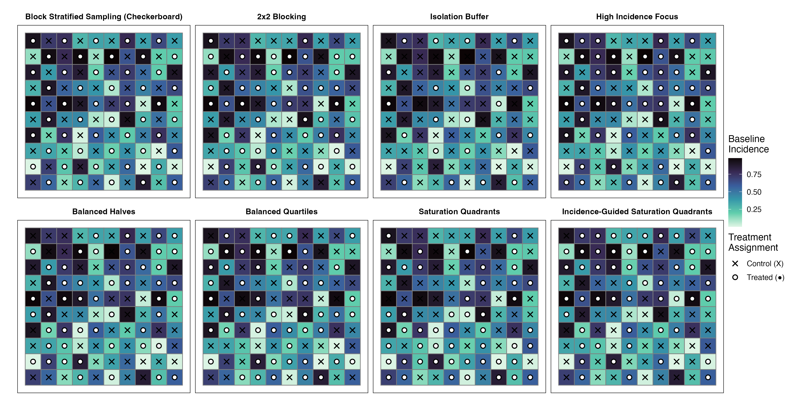

# Modular Incidence Simulation for Spatial CRT Design Evaluation

**Verified completion checkpoint (2026-10-02):** the observed-incidence application
and focused tail refinement are complete. Production: 1,248 reporting rows,
936 computational sources, 7,598,000 independent outcome fits; separate tail refinement
adds 2,280,000 outcomes on the same allocations. All settings pass completeness
and the approved mean-MSE/coverage Monte Carlo gates; no warnings, aliases,
boundary fits or failures. Coverage remains below 95% and allocation tails remain
uncertain. See [completed findings](docs/plans/nc_sud_application_findings_2026-10-02.md).
Full chapter/appendix and derived CTJ/SI drafts are complete and verified; author review and submission metadata remain. See [manuscript completion findings](docs/plans/manuscript_completion_findings_2026-10-02.md).

**CTJ layout review (October 2):** an [eight-page two-column reading preview](paper/ctj_manuscript/CTJ_Reading.pdf)
now accompanies the [21-page submission draft](paper/ctj_manuscript/CTJ_Manuscript.pdf).
Both use one master manuscript and shared exhibit definitions. The approved original title is restored. Six revised exhibits show all-nine-design
rules/benchmark, compact simulation accuracy/decomposition, observed NC geography
and annual NC accuracy. Detailed tail/budget/parameter displays remain in supporting
material. Author order is Walther, Habib, Simpson, Lin. See the
[exhibit revision and teach-back](docs/plans/ctj_exhibit_revision_findings_2026-10-02.md).
See [layout findings and build commands](docs/plans/ctj_layout_review_2026-10-02.md).

**Full prelim assembly (October 2):** `bios-dissertation/prelim/prelim.pdf` now
combines the current literature review, Chapters 2–4, appendices and one
bibliography (177 pages). Chapter 3 remains 42 body + 25 appendix pages. CTJ
reading references now flow from page 7 into both columns of page 8. See
[assembly/reference review and rebuild commands](docs/plans/prelim_assembly_ctj_reference_review_2026-10-02.md).
The individual Chapter 3 sync hook remains unchanged; rerun the full assembly
builder after chapter syncs. This full-length draft awaits author review.

> For AI session context and quick technical reference, see [AGENTS.md](AGENTS.md).

**Application planning (2026-10-02):** the
[NC SUD application design](docs/plans/nc_sud_application_plan_2026-10-02.md)
and [integrated continuation prompt](docs/plans/continuation_prompt_2026-10-02.md)
combine the earlier manuscript decisions with the real-data application request.
The author chose continuous SAR education outcomes, using observed SUD incidence
for allocation without an assumed incidence–education baseline relationship.
An incidence-related baseline is a hypothetical sensitivity; the grid study
continues to include its incidence baseline term. The implementation plan is
approved and execution is complete. The independent alignment review is
complete; see the [review](docs/plans/nc_sud_independent_review_2026-10-02.md) and
[implementation plan](docs/plans/nc_sud_implementation_plan_2026-10-02.md). The
author requests ASAP completion rather than the earlier date-based schedule.
The plan covers verification, results and
subsequent chapter/appendix and CTJ/supplement updates.

The [visual application companion](application/report/real_sud_companion.html)
shows observed-rate maps, model meaning, adaptations and filterable performance.
The current companion displays verified production and separate refined-risk results. Smoke/pilot outputs remain preliminary engineering checks. Run instructions and
verification are in [application/README.md](application/README.md); the
[implementation findings](docs/plans/nc_sud_implementation_findings_2026-10-02.md)
record the code walkthrough and evidence. Full application and manuscript drafts are complete; author review is next.

**Manuscript continuation (2026-09-27):** The [Chapter 2 check and accepted-manuscript
review](docs/plans/ch2_check_findings_2026-09-27.md) records the evidence, limits and
open decisions for the SRS benchmark and Checkerboard discussion. Project 1 remains
finalized and read-only. October 2 decisions retain Checkerboard in the main
Project 2 comparison, with detailed diagnostics in the appendix, and approve a
brief Chapter 2 extension reference. CTJ will stand alone and cite Project 1.
The allocation-risk pilot remains supporting evidence; the completed NC application provides the
focused confirmation, without expanding the grid pilot first. See
[TODO](docs/plans/TODO.md) for remaining work.

**Allocation-risk analysis (2026-09-27):** the author authorized a nested pilot
comparing all eight designs with SRS, including variability and upper tails of
allocation-specific MSE. See the [methods and findings note](docs/plans/allocation_risk_findings_2026-09-27.md)
for scope, precision limitations, code walkthrough, and interpretation. This uses
queen weights, oracle ML, tau=1, ten fixed incidence surfaces and parameter corners;
it does not replace the main study or run the revised NC application.

To reproduce it, from `code/`, run `16_allocation_risk.R pilot 8`, then
`18_allocation_risk_precision.R`, with `VECLIB_MAXIMUM_THREADS=1`,
`OPENBLAS_NUM_THREADS=1`, and `OMP_NUM_THREADS=1` set before starting R.
`Rscript 17_allocation_risk_summary.R pilot` and
`Rscript 17_allocation_risk_summary.R precision_R400` regenerate the tables in
`results/allocation_risk/summary/`. Behavior checks are in
`tests/test_allocation_risk.R` and `tests/test_allocation_risk_summary.R`.
Individual-fit caches are gitignored; outputs and manifests are isolated from the
existing simulation. Full commands and the rationale for outcome replication are
in the linked note.

## Overview

This project evaluates which **treatment assignment design** produces the most accurate
estimates of an intervention effect when outcome incidence is spatially heterogeneous
and spillover effects are present. The setting is a Spatial Cluster Randomized Trial
(CRT) on a 10x10 regular lattice grid of 100 clusters.

**Research question:** Across a wide range of spatial dependence, spillover magnitude,
and incidence structures, which of 8 candidate treatment assignment strategies minimizes
estimation error (MSE) and maintains valid inferential coverage?

**Application context:** Sudden Unexpected Death (SUD) in North Carolina counties.
The Poisson incidence mode uses a SUD base rate of 35/100,000 (Mirzaei et al.),
consistent with county-level Poisson analyses by Gan et al. and Watson et al.

---

## Project Lineage

This is a clean-room rewrite of
`archive/OutcomeIncidenceDesign_Legacy/SpatialCRT_Incidence_TreatmentAssignment_Simulation.Rmd`
(~600 lines, monolithic Rmd). Refactoring goals:

1. **Modularity** — numbered R scripts (01-09) that can be run independently or sourced in sequence
2. **Three incidence modes** — Added Spatial (SAR filter) and Poisson modes alongside iid Uniform
3. **Correctness fixes** — Seven specific bugs and design flaws identified and corrected (see below)
4. **Long-run reliability** — Replaced `save.image()` with targeted `saveRDS()`, added per-scenario seeding, ETA logging, and degenerate case handling

The predecessor Rmd is preserved untouched.

---

## File Inventory

| File | Lines | Purpose | Key Functions |
|------|------:|---------|---------------|
| `00_mathematical_specification.Rmd` | ~495 | Theory doc with full LaTeX DGP formulas | (rendered to HTML) |
| `01_spatial_setup.R` | 54 | Regular lattice grid, rook/queen weight matrices | `build_spatial_grid()`, `get_active_spatial()` |
| `02_incidence_generation.R` | 112 | Three incidence generation modes | `generate_incidence()` + 3 mode functions |
| `03_designs.R` | ~162 | Eight treatment assignment strategies | `get_designs()`, `get_design_names()`, `is_design_deterministic()` |
| `04_estimation.R` | 102 | DIM and MLE estimation with CI extraction | `estimate_tau()` |
| `05_run_simulation.R` | ~385 | Main orchestrator, nested parameter loop | `run_incidence_config()` |
| `06_visualizations.R` | ~800 | All plots and summary tables | 18 functions; entry point `run_all_visualizations()` |
| `07_results_summary.Rmd` | ~800 | Rendered results report (HTML/PDF) | Knitted summary of all MLE findings |
| `08_design_recommendations.R` | ~560 | Personalized design recommendations | `run_recommendation_report()`, `table_scenario_lookup()`, `generate_commentary()` |
| `09_MLE_design_recommendation_report.Rmd` | ~984 | Companion narrative PDF report | Knitted to `results/MLE_design_recommendation_report.pdf` |
| `10_statistical_comparisons.R` | ~1050 | Formal statistical hypothesis tests | `run_friedman_test()`, `run_nemenyi_posthoc()`, `run_pairwise_wilcoxon()`, `run_conditional_tests()`, `plot_cd_diagram()`, `plot_mse_boxplot_with_stars()`, `plot_pvalue_heatmap()` |
| `11_statistical_comparisons_report.qmd` | ~543 | Statistical comparisons narrative report | Rendered to `results/11_statistical_comparisons_report.{html,pdf}` |
| `12_six_design_statistical_comparisons.R` | ~180 | Re-runs Friedman/Nemenyi/Wilcoxon on the 6 manuscript designs, regenerates named-label figures | Outputs to `results/six_design_manuscript/` |
| `13_dissertation_results_extract.R` | ~75 | Pulls per-incidence-mode/per-parameter/robustness numbers for the dissertation chapter | Outputs `results/six_design_manuscript/dissertation_results_extract.txt` |
| `14_manuscript_supplement_figures.R` | ~470 | Fresh 8-design consolidation test (justifies dropping 2 designs) + CTJ Supplementary Information figure suite + reordered/merged main-text figures + application table | Outputs `results/eight_design_supplementary/`, `results/six_design_manuscript/si_figures/` |
| `19_manuscript_exhibits.R` | ~60 | Export current full nine-design grid regime means and a six-design journal figure | `results/srs_benchmark/` and CTJ figures |
| `paper/tools/verify_manuscripts.py` | ~175 | Reconcile current manuscript cells, derived supplement and assets | Aggregate CSV inputs; fails on drift |
| `complete_after_mle.R` | ~250 | Post-completion script (viz + docs + stats) | Run once after MLE finishes |

---

## How to Run

### Prerequisites

```r
install.packages(c("spdep", "spatialreg", "dplyr", "tidyr",
                   "digest", "parallel", "ggplot2", "viridis"))
```

### Running the simulation (2026-09 revision; ~14 minutes on 10 cores)

```bash
cd projects/IncidenceDesign/code
# BLAS must be single-threaded per worker (the runner refuses otherwise):
VECLIB_MAXIMUM_THREADS=1 OPENBLAS_NUM_THREADS=1 OMP_NUM_THREADS=1 Rscript 05_run_simulation.R pilot  # ~1 min
VECLIB_MAXIMUM_THREADS=1 OPENBLAS_NUM_THREADS=1 OMP_NUM_THREADS=1 Rscript 05_run_simulation.R full   # ~14 min
```

- One run fits both estimators (oracle, primary; non-oracle, sensitivity) to the same
  simulated data, and writes them to `results/sim_data/` (`pilot` output goes to
  `results/pilot_rev_2026-09/`).
- Checkpoints are kept per work unit under `results/checkpoints/rev_2026-09/<profile>/`, with
  a manifest. Any change to parameters, code (01–05), packages or BLAS makes the runner
  refuse to resume, so delete that directory to start fresh.
- DIM is not run by the revised script (the DIM baseline in `sim_data/` predates the revision).
- Method specification: `docs/plans/simulation-revision-spec.md`.

### Tests

```bash
VECLIB_MAXIMUM_THREADS=1 OPENBLAS_NUM_THREADS=1 OMP_NUM_THREADS=1 Rscript tests/test_simulation_revision.R
Rscript tests/verify_full_run_rev_2026-09.R
```

- The first runs the design, seeding, aliasing and known-answer tests, plus the ~7-minute
  estimator-equivalence test (`SKIP_EQUIVALENCE=1` skips it).
- The second runs the integrity checks on the latest full run.
- `tests/crosscheck_lagsarlm_rev_2026-09.R` recomputes 1% of the scenarios with `lagsarlm`.

### Generating Visualizations Only

```r
source("06_visualizations.R")

# All configs, most recent MLE results (primary estimator):
run_all_visualizations(results_dir = normalizePath("../results"), estimation_mode = "MLE_tau_sweep")

# Single incidence config with all tables:
r <- load_latest_results(estimation_mode = "MLE_tau_sweep")
cfgs <- split_by_incidence_config(r)
run_standard_tables(cfgs[["iid Uniform"]], "iid Uniform")
```

### Generating Design Recommendations

```r
source("08_design_recommendations.R")

# Full recommendation report (PDF + console output):
run_recommendation_report(estimation_mode = "MLE_tau_sweep")

# Specific scenario lookup:
r <- load_latest_results(estimation_mode = "MLE_tau_sweep")
cfgs <- split_by_incidence_config(r)
table_scenario_lookup(cfgs[["iid Uniform"]], rho = 0.2, gamma = 0.7,
                      spill_type = "both", nb_type = "queen")
```

---

## Simulation Design Summary

**Grid:** 10x10 regular lattice, N = 100 clusters. Two contiguity structures:
rook (4-connected) and queen (8-connected).

**Data Generating Process — Spatial Durbin Model (SDM):**

```
Y = (I - rho*W)^{-1} * [tau*Z + gamma*Spill(Z) + beta*X + epsilon]
```

where beta = 1.0, sigma = 1.0, and `Spill(Z)` is the row-standardized mean treatment of
neighbors. Two spillover modes: `control_only` (gamma applied only to control units) and
`both` (applied to all units). (Despite the historical "SDM" label, only treatment is
spatially lagged.)

**Monte Carlo structure (2026-09 revision):** K = 10 incidence surfaces per config ×
J = 25 design draws per surface = 250 fits per scenario. The design for surface k is drawn
from X_k, the outcome and analysis use the same X_k, and every fit has its own noise draw.
All draws are seeded from keys.

**Incidence modes:**
- **iid Uniform:** X_i ~ Uniform(0,1) independently
- **Spatial:** SAR filter + pnorm transform — spatially correlated but marginally Uniform(0,1)
- **Poisson:** Spatially correlated log-rates -> Poisson counts (100,000 people per cluster, ≈35 expected deaths) -> rank-normalized rates in [0,1]

**Treatment designs:** 8 strategies — Checkerboard, High Incidence Focus, Saturation
Quadrants, Isolation Buffer, 2x2 Blocking, Balanced Quartiles, Balanced Halves,
Incidence-Guided Saturation Quadrants.

<p align="center">
  
  <br><em>Sample treatment assignments for each design applied to a single realization of iid Uniform(0,1) baseline incidence. Tile color indicates baseline incidence (darker = higher). Circles = treated, crosses = control.</em>
</p>

**Estimation:** ML spatial-lag model, oracle `Y ~ Z + Spill + X` (primary) and non-oracle `Y ~ Z + X` (sensitivity), fit with `fit_sar_lag()`. That's the same estimator as `spatialreg::lagsarlm(method = "eigen")` (validated to ~1e-7 on 5,120 fits) at ~120× the speed, since `lagsarlm` spends ~94% of its time in a `gc()` call.

**True tau (tau-sweep):** τ ∈ {0.8, 1.0, 1.5, 2.0, 3.0} — swept to assess design robustness across effect sizes and estimate power curves.

**Total scenarios:** 5 tau × 5 incidence configs × 2 neighbor types × 4 rho × 4 gamma × 2 spillover types × 8 designs = **12,800 scenarios**
(× 250 fits × 2 estimators = 6.4M fits in the 2026-09 run)

---

## Results Summary

### Revised simulation (COMPLETE — 2026-09-24, 12,800 scenarios × 2 estimators)

The results for oracle, τ = 1 and the 6 manuscript designs are below; `results/six_design_manuscript/`
has the full detail.

| Design | Queen MSE | Rook MSE |
|---|---|---|
| Incidence-Guided Saturation Quadrants | 0.091 | 0.072 |
| Balanced Quartiles | 0.131 | 0.084 |
| Isolation Buffer | 0.160 | 0.133 |
| High Incidence Focus | 0.245 | 0.206 |
| 2x2 Blocking | 0.319 | 0.128 |
| Checkerboard | 1.087 | 0.480 |

- **Coverage** is ≈0.94 for every design except Checkerboard × rook, which is 0.15 because τ is not
  identified when WZ = 1 − Z. Those estimates are kept but flagged. Coverage doesn't separate
  the designs; MSE does.
- **Across τ:** under queen the rank order is the same at every τ (Friedman χ² 377–456, all
  p < 2e-16). Per-τ tests share draws, so they aren't independent confirmations. Under
  rook, 2x2 Blocking and Isolation Buffer swap at τ = 0.8.
- **Robustness:** every adjacent pair differs significantly on 50 independent (config × surface)
  units.
- **Consolidation:** Saturation Quadrants and Balanced Halves are statistically indistinguishable
  from Incidence-Guided Saturation Quadrants and Balanced Quartiles, which is why the
  manuscripts carry 6 designs.
- **Non-oracle sensitivity:** bias −0.12 to −0.40 and coverage 0.51–0.90 for every design. It also
  has lower variance where Z and WZ are collinear (queen Checkerboard MSE 1.09 → 0.11).
- **Integrity** (`results/sim_data/full_run_verification.txt`): N_Valid_Est = 250 everywhere and
  zero non-aliasing warnings. Aliasing occurs only in Checkerboard × rook, plus 20 Isolation
  Buffer × rook scenarios that each drew the exact checkerboard once.

### Superseded (April 2026)

The April tau-sweep and March baseline results (e.g. "D8 MSE 0.079, D1 0.802") rest on the
implementation oversights fixed by the revision. They're archived in
`results/archive/pre_revision_20260924/` (see its README) and must not be cited. The live CTJ/SI drafts now use the verified revised results and completed application; old drafts are archived.

### Results Directory Structure

```
results/
  MLE_tau_sweep_design_recommendations_{queen,rook}.pdf  # 08 figures/tables PDF (oracle, per neighbor type)
  MLE_tau_sweep_incidence_overview.pdf        # Incidence heatmaps + distributions
  MLE_statistical_comparisons.pdf             # 10 figures (8 designs, tau = 1)
  00/07/09/11 rendered reports                # regenerated in Phase C
  sim_data/
    sim_results_MLE_tau_sweep_combined_20260924_025509.rds         # PRIMARY (oracle), 12,800 rows
    sim_results_MLEnonoracle_tau_sweep_combined_20260924_025509.rds # non-oracle sensitivity
    sim_results_*_{iid,spatial,poisson}_20260924_025509.rds          # per-mode splits
    surface_results_*_20260924_025509.rds     # one row per (scenario, surface)
    warnings_*_20260924_025509.csv            # non-aliasing warnings (none)
    run_info_20260924_025509.rds              # manifest, parameters, sessionInfo
    full_run_verification.txt
    sim_results_DIM_*_20260304_195321.rds     # pre-revision DIM baseline (not re-run)
  six_design_manuscript/                      # 12 (oracle), 13, 14: summaries + queen/ and rook/ figures
  six_design_manuscript_nonoracle/            # 12 (non-oracle)
  eight_design_supplementary/                 # 14(a) consolidation check
  estimator_validation/                       # fit_sar_lag vs lagsarlm (5,120 fits) + 1% full-run cross-check
  pilot_rev_2026-09/                          # B4 pilot outputs + pilot_report.txt
  mle_per_config/                             # 06 per-config PDFs
  figures/design_samples_8panel.{png,pdf}
  archive/pre_revision_20260924/              # everything from the April runs
  checkpoints/rev_2026-09/                    # (git-ignored) manifest-checked unit checkpoints
```

**Key rule:** Results for iid Uniform, Spatial, and Poisson, and for rook and queen, are
reported **separately**; pooled numbers appear only when labeled as pooled. The combined .rds exists for loading convenience only.
`load_latest_results()` automatically detects the `sim_data/` subdirectory.

### Paper Directory Structure

> **Note:** the modular Quarto manuscript framework described in earlier versions of
> this README (`paper/manuscript/` with `_abstract.qmd`/`_methods.qmd`/etc. child
> sections) was retired 2026-07-02 in favor of two manuscripts written fresh from
> scratch (see below). That structure is preserved read-only as `paper/archive_manuscript/`
> for reference/fact-checking only.

```
paper/
  SpatialCRT_IncidenceDesign.bib              # Single bibliography shared by both manuscripts
  SAGE_Journal_Template/                      # sagej.cls, SageH.bst, SageV.bst (CTJ render dependency)
  SpatialCRT_IncidenceDesign_Presentation.qmd # Presentation slides (scaffold)
  report/
    IncidenceSpatialCRT_Report.qmd            # Unified project report (sources R modules)
    IncidenceSpatialCRT_Report.pdf            # Rendered PDF
    IncidenceDesign_ProjectSummary.qmd        # Brief project summary report (ranked figures)
    IncidenceDesign_ProjectSummary.pdf        # Rendered PDF summary
  ctj_manuscript/                             # PRIMARY — Clinical Trials (SAGE) submission draft
    CTJ_Manuscript.{tex,pdf}                  # Full benchmark/application plus detailed subset; 6 exhibits (journal cap)
    Supplementary_Information.{tex,pdf}       # SI: reproducibility, full 8-design comparison,
                                               #   metric formulas, per-parameter sensitivity,
                                               #   NC application maps + table (S1-S11)
    figures/                                  # Main-text + SI figures (incl. application_maps/,
                                               #   si_figures/ subdirectories)
  dissertation_chapter/                       # Canonical full chapter and appendix, no length ceiling
    Dissertation_Chapter.{qmd,pdf}
    shared-refs.bib -> ../SpatialCRT_IncidenceDesign.bib  # symlink (Quarto underscore workaround)
  archive_manuscript/                         # Retired modular-Quarto manuscript (reference only)
```

The **unified report** (`paper/report/`) consolidates all code-side reports into a single
end-to-end reference (50+ pages): spatial setup, DGP, 8 design illustrations, estimation
methods, simulation design, all MLE results, full statistical comparisons (Section 10 with
Friedman/Nemenyi/Wilcoxon tests and conditional CD diagrams), and design recommendations.

The **project summary report** (`paper/report/IncidenceDesign_ProjectSummary.{qmd,html,pdf}`)
is a shorter companion document with the ranked-figure suite (clean CD diagrams, bias-variance
decomposition, rank/MSE heatmaps) that the CTJ manuscript and its SI figures were adapted from.

The **dissertation chapter** is the canonical long-form source, with a full body
and appendix. The **CTJ manuscript** is its standalone condensed derivative:
3,215 prose/heading words (3,381 including end declarations), a 283-word structured abstract and exactly six exhibits
(two tables/four figures). It includes all nine designs in the full benchmark
and application while preserving the detailed six-design grid analysis as a
labeled subset. The supplement retains full methods/results and all 22 chapter
tables. April/synthetic application numbers are absent from the live drafts.

Current CTJ figures are vector PDFs in `figures/compact/`: `nc_planning_map.pdf`,
`grid_accuracy.pdf`, `grid_bias_variance.pdf`, and `nc_annual_accuracy.pdf`.
They span both reading columns, with 9-point base fonts at their 174-mm export width.
The chapter uses the compact annual comparison in its body and retains absolute
MSE/tail displays in Appendix A7; full parameter grid figures remain in the chapter/SI.
Older assets remain preserved. Recreate these displays without rerunning simulation:

```sh
Rscript code/20_manuscript_figure_revision.R
Rscript code/tests/test_manuscript_exhibits.R
python3 paper/tools/verify_manuscripts.py
```

The export reads completed results, writes traceable plot-data CSVs to
`results/manuscript_exhibit_revision_20261002/`, and copies the selected PDFs to the
manuscript figure directories (all four to CTJ; annual heatmap to the chapter). Its exact bias/variance decomposition corrects
sample variance by 249/250; annual heatmap cells divide means by matched SRS means.
It does not estimate pooled MC intervals or change computational outputs/weights.
Selection/provenance: [exhibit findings](docs/plans/ctj_exhibit_revision_findings_2026-10-02.md).
Submission components: [checklist](paper/ctj_manuscript/submission_checklist.md),
[cover letter](paper/ctj_manuscript/Cover_Letter_Draft.md) and separate figure legends.

Regenerate journal grid exhibits: `Rscript code/19_manuscript_exhibits.R`.
Verify document tables/figures/references: `python3 paper/tools/verify_manuscripts.py`.
The checker reads authorized aggregate outputs and rejects incorrect values.
Chapter builds use the approved Quarto/sync workflow; CTJ/SI use TinyTeX/latexmk
with the existing Sage template paths (see AGENTS).

---

## Key Design Decisions

1. **Incidence surfaces generated once per `(mode, rho_X, k)`** and shared by every block of
   the config. Spatial model parameters affect outcome propagation, not incidence itself.

2. **Matched surfaces (2026-09):** each design draw is built from the same incidence surface
   the outcome and analysis use. The pre-revision code built designs from surface 1 but
   analyzed surface k.

3. **Key-based seeding** — every draw of X, Z and ε is seeded from a key with fixed RNG
   kinds, so results are identical sequentially, in parallel and in any order.

4. **Separate reporting by incidence mode and neighbor type** — queen is primary, rook the
   sensitivity case; pooling only when labeled.

5. **Oracle spillover in MLE** — the primary model includes the true Spill covariate. The
   non-oracle model (`Y ~ Z + X`) is fit to the same data as a sensitivity analysis.

6. **DIM iteration counts** — Originally planned at 100,000 iterations/scenario; reduced
   to 2,500 (25 design x 100 outcome resamples) for practical runtime.

7. **All 8 designs included** — Design IDs 1–8 are all included in the default
   `design_ids` sweep in `05_run_simulation.R`.

---

## Known Issues & Bugs Fixed

| # | Issue | Root Cause | Fix |
|---|-------|-----------|-----|
| 1 | PDF render failure | `\u03c1` (Unicode rho) unsupported by `pdf()` device | Replace with literal `"rho"` text |
| 2 | Pairwise dominance NaN | `make.names()` mangled column names in `pivot_wider` output | Use `wide[[designs[i]]]` direct bracket access |
| 3 | Eta-squared > 1.0 | `var(group_means)/var(total)` incorrect formula | Proper: `SS_between/SS_total` |
| 4 | `I()` namespace conflict | `I <- diag(N)` shadowed `base::I()` | Renamed to `I_mat` |
| 5 | Degenerate Z crash | Designs occasionally produce all-treated or all-control | Early `NA` return in `estimate_tau()` |
| 6 | R sprintf 10k limit | `complete_after_mle.R` format string too long | Write docs via Claude Code `Write` tool |

---

## Status & Next Steps

**Completed:**
- [x] **2026-09-24: simulation revision (step 0.5)** — spec, M1–M8 code changes, tests, pilot, full re-run, downstream code (12–14, 06, 08) and outputs regenerated; April outputs archived
- [x] All code files (00–11) written and tested
- [x] Mathematical specification document (00) rendered to HTML
- [x] DIM simulation: 1,920 scenarios (prior 6-design sweep), visualizations generated (baseline)
- [x] MLE simulation: 1,920 scenarios (prior 6-design sweep), visualizations generated, zero convergence failures
- [x] Design recommendations module (08) with validation tests
- [x] Narrative PDF report (09): `results/MLE_design_recommendation_report.pdf`
- [x] Results directory reorganized: `sim_data/`, `mle_per_config/`, `dim/`, `archive/`
- [x] Project documentation: AGENTS.md + README.md
- [x] Design set expanded to 8 designs (Balanced Halves, Incidence-Guided Saturation Quadrants added)
- [x] Re-run MLE simulation: 2,560 scenarios covering all 8 designs (1–8) — completed 2026-03-22
- [x] Unified project report consolidating all code-side reports — completed 2026-03-23
- [x] Modular manuscript framework with converted LaTeX section drafts — completed 2026-03-23
- [x] Statistical comparisons module (10) + report (11): Friedman/Nemenyi/Wilcoxon tests — completed 2026-03-25
- [x] Comprehensive report (`paper/report/`) expanded with full statistical section, design figures
- [x] **Tau-sweep simulation: 12,800 scenarios across τ ∈ {0.8, 1.0, 1.5, 2.0, 3.0}** — completed 2026-04-08
- [x] Power metric added (P(reject H₀: τ=0)) and Monte Carlo SEs via delta-method (N_Valid_Est, SE_MSE)
- [x] All reports regenerated with tau sensitivity sections (MSE vs τ, power curves, coverage, rank stability)
- [x] Statistical comparisons updated for tau-sweep; conditional Friedman/Nemenyi across all τ levels
- [x] Pre-sweep deliverables archived: `results/archive/pre_tau_sweep_20260408/`
- [x] **Two manuscripts drafted (first full pass): a short *Clinical Trials* (SAGE)
      submission and a longer-form dissertation chapter** — completed 2026-07-02.
      Both written fresh, sharing a bibliography (`paper/IncidenceDesign_shared.bib`)
      but not prose files. Both present 6 designs (dropping Saturation Quadrants and
      Balanced Halves as statistically redundant), have no DIM-vs-MLE comparison
      anywhere, and use full design names throughout (no numbered shorthand). See
      `paper/ctj_manuscript/` and `paper/dissertation_chapter/`. Application-section
      numbers are an explicitly labeled simulated placeholder pending real
      SUDDEN-derived NC county data (in progress with an epidemiology collaborator).
- [x] **CTJ Supplementary Information drafted and reviewed** — completed 2026-07-03.
      `paper/ctj_manuscript/Supplementary_Information.tex` (14+ pages, S-prefixed
      numbering) fulfills the three items the main text defers to "online
      supplementary material": reproducibility/seeding/code (S1-S2), metric
      formulas + estimation model (S3-S4), the full 8-design table (S5), and the
      complete eight-design comparison (S6) — the only 8-design section anywhere.
      Sections S7-S11 cover per-incidence-mode rankings, parameter/tau sensitivity,
      robustness/win-rate, and an application-scale illustration for the 6 retained
      designs. Generated by new `code/14_manuscript_supplement_figures.R`, which
      also produced a reordered (best-to-worst) main-text MSE figure and a new
      ranked bias-variance figure. Reviewed by a fresh agent against the plan's
      hard constraints (6-design scope, no DIM comparison, no shorthand, numeric
      accuracy, S-numbering) — one gap found and fixed.
- [x] **NC application maps added to both documents** — completed 2026-07-03. The
      three maps already produced by `application/` (58-cluster service-area map,
      synthetic placeholder incidence surface, k-means saturation regions) were
      added to SI Section S11 (Figures S8-S10) and the incidence map alone to the
      main text's Application section (Figure 4), to visually motivate the study.
      To stay within the CTJ's 6-exhibit cap, the separate coverage and
      tau-sensitivity figures were merged into one 2-panel figure. **Open:** a
      deliberate review of the full main-text + SI figure list (this was a quick
      fit, not a considered final selection) — see Open To-Dos below.
- [x] **Real-data ingestion pipeline built and ready** — completed 2026-09-04.
      `application/code/run_application_profiles.R` now has `load_real_sud_data()`,
      `integrate_real_sud_data()`, and `run_all_real_years()` to read, clean, and
      aggregate the real county-level SUD data onto the 58 community-college
      clusters once it arrives, writing to a separate `real_{year}_{profile}/`
      output directory so the existing synthetic results are untouched. **Nothing
      has been run yet** — this is dormant plumbing waiting on the actual dataset;
      see Open To-Dos below for the two key next steps.
- [x] **Real SUD data aggregated to the 58 clusters**, completed 2026-09-25.
      `application/code/run_sud_aggregation.R` joins Habib's methodology death
      counts (`sudden_county_year.csv`, 21,147 deaths) to SEER `pop_18_64`
      (`final_county_sudden.csv`) and writes county- and cluster-level rates per 100,000
      by year, total, and average to the gitignored `application/data/derived/`. It
      reproduces Habib (2026) exactly (see `application/README.md`), and the tests pass (`application/tests/test_application_data.R`).
      The design comparison on these surfaces has not been run yet.

---

## Open To-Dos / Future Work Roadmap

The core simulation is complete. The following extensions would strengthen the study:

### Simulation Extensions

| Priority | Extension | Description | Notes |
|----------|-----------|-------------|-------|
| High | **Non-oracle MLE** | Re-run MLE without true Spill covariate (`include_spill_covariate = FALSE`) | Toggle already exists in `estimate_tau()`; reveals realistic vs. oracle performance gap |
| Medium | **Heterogeneous population** | Poisson mode with `pop_mode = "heterogeneous"` (unequal cluster sizes) | `pop_mode` parameter exists in `05`; needs `generate_incidence_poisson()` extension |
| Medium | **Grid sensitivity** | Rerun with `grid_dim = 8` (64 clusters) or `grid_dim = 15` (225 clusters) | Tests whether D3/D8 dominance holds at different spatial scales |
| Low | **DIM tau-sweep** | Re-run DIM across τ ∈ {0.8, 1.0, 1.5, 2.0, 3.0} to compute DIM power curves | Low priority — DIM is confirmed naive baseline; MLE results are primary |
| Low | **Heterogeneous beta** | Vary `beta` (incidence coefficient) across incidence modes | Would test robustness to signal strength of incidence covariate |

### Manuscript Development

The application and all required full drafts are complete. Next: consolidated
author/Claude review, author-only ethics/data-use and corresponding-author details,
coauthor consent, then approved submission. No new full simulation is required by
the independent review. Calendar deadlines were superseded by ASAP completion;
CTJ remains the submission target. UNC thesis-template integration and conference
slides are future work, not omitted deliverables of this study completion.

---

## Application to Real NC Geography

`application/` adapts all eight strategies and SRS to 58 community-college
clusters partitioning NC's 100 counties. The observed 2018–2021 corrected SUD
counts and populations are fixed; no primary synthetic incidence is generated.
Incidence directs allocation; the primary education DGP has β = 0 and constant
τ = 1. The hypothetical β = 1/X-adjusted sensitivity, rook corners and alternative
regional summaries are separate. Production comprises 1,248 yearly reporting rows
and 7,598,000 independent fits; tail refinement adds 2,280,000 outcomes for the
same sampled allocations. Results, models, budgets, precision and limitations
are in [application README](application/README.md) and the
[HTML companion](application/report/real_sud_companion.html). Restricted county
sources/derived files and fit caches remain ignored. The old synthetic run is
preserved as historical output and unused in current documents.

---

## Relationship to SpillSpatialDepSim

IncidenceDesign extends the simulation framework from `projects/SpillSpatialDepSim/`.
SpillSpatialDepSim established the SAR model, spillover mechanics, and block stratification
approach in an applied NC DOC context (8–12 districts). IncidenceDesign asks the same
core design question at larger scale (100 clusters) with systematic variation across
incidence modes and formal design strategies.

---

## References

- Mirzaei, A. et al. (2019). Sudden unexpected death rates.
- Gan, W. et al. (2019). County-level Poisson regression for SUD mortality.
- Watson, K. et al. (AHA). Census tract-level spatial analysis of SUD.
- LeSage, J. & Pace, R.K. (2009). *Introduction to Spatial Econometrics*. CRC Press.
- R packages: `spdep` (Bivand et al.), `spatialreg` (Bivand & Piras), `digest`, `ggplot2`, `viridis`
