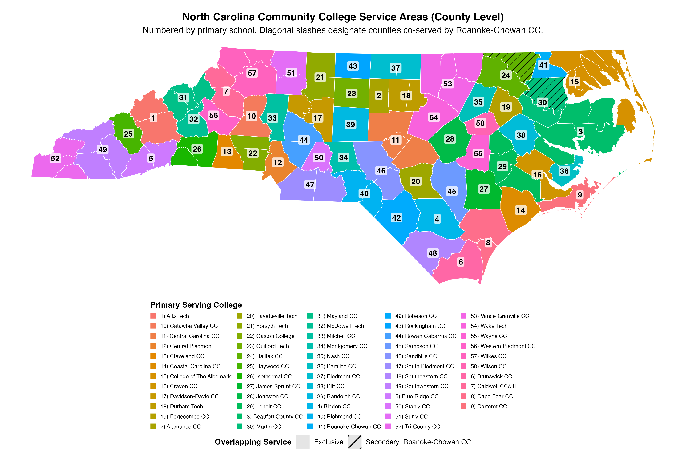

# NC SUD Application

This directory adapts the IncidenceDesign simulation framework from a regular 10x10 grid to the North Carolina Community College service-area application. The application uses 58 irregular spatial clusters, Queen-contiguity neighbors, and population-balanced design adaptations to evaluate treatment assignment strategies for a future SUD intervention study.

## Directory Structure

```text
application/
  code/      R scripts for mapping, synthetic incidence, designs, and runs
  data/      source NC Community College mapping spreadsheets
  notes/     implementation notes and full-run instructions
  report/    Quarto report source plus rendered HTML/PDF outputs
  results/   smoke, pilot, full, and cached population outputs
```

## Study Region

Counties are assigned to one of 58 clusters based on primary North Carolina Community College service coverage. The map below shows the county-level assignment used to form the irregular spatial clusters for randomization and outcome simulation.



## Current State

The synthetic-incidence application pipeline is implemented and has been run end to end.

- Synthetic baseline SUD incidence is generated with a Poisson SAR process over the 58 clusters.
- All 8 treatment assignment designs have irregular-map adaptations.
- Smoke, pilot, and full evaluation profiles are available through `code/run_application_profiles.R`.
- The full synthetic run completed 640 scenarios and 160,000 converged MLE fits.
- The current report is available in `report/IncidenceDesign_Application_Report.html` and `report/IncidenceDesign_Application_Report.pdf`.

## Current Results

Using synthetic incidence, the best-performing designs by mean MSE were Balanced Quartiles and Balanced Halves, followed closely by Saturation Regions, 2x2 Blocking, and Incidence-Guided Saturation Regions. Block Stratified Sampling, Isolation Buffer, and High Incidence Focus performed substantially worse.

The current working recommendation is to carry Balanced Quartiles, Balanced Halves, Saturation Regions, and Incidence-Guided Saturation Regions forward as the main candidate designs. This recommendation should be finalized only after repeating the analysis with true SUD incidence data.

## Outstanding Work

The current incidence data are synthetic placeholders. The next substantive step is to replace them with true SUD incidence data using the same schema:

- `cluster_id`
- `population`
- `sud_count`
- `sud_rate_per_100k`
- `incidence_rank01`

After true incidence data are available, rerun the full application profile and update the report/recommendation using those results.
