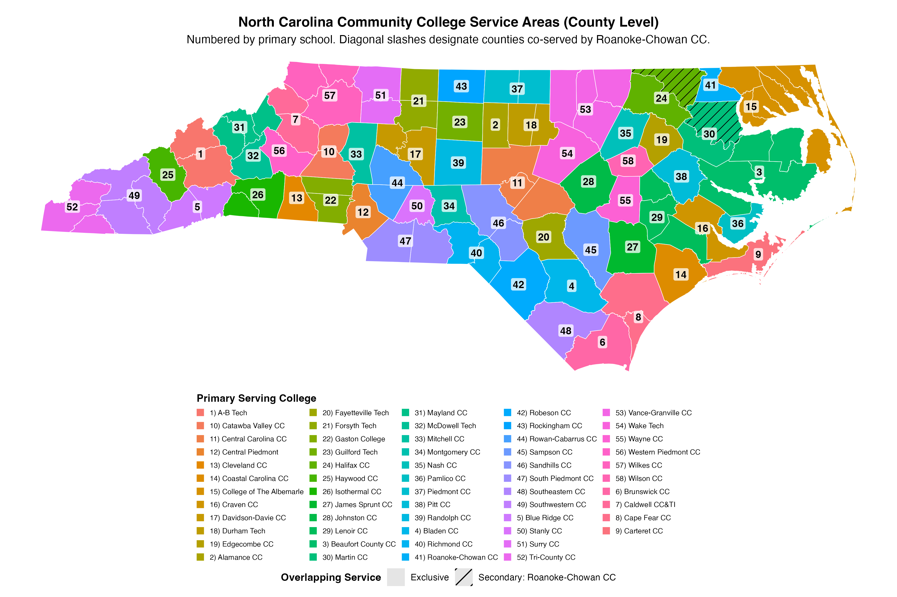

# NC SUD Application

This directory adapts the IncidenceDesign simulation framework from a regular 10x10 grid to the North Carolina Community College service-area application. The application uses 58 irregular spatial clusters, Queen-contiguity neighbors, and population-balanced design adaptations to evaluate treatment assignment strategies for a future SUD intervention study.

## Directory Structure

```text
application/
  code/      R scripts for mapping, real-data aggregation, weights, synthetic incidence, designs, and runs
  data/      NC Community College mapping CSVs and nc_cluster_weights.rds (tracked) + restricted
             SUD source data and derived/ outputs (gitignored; see "Real SUD incidence data" below)
  tests/     test_application_data.R
  notes/     implementation notes and full-run instructions
  report/    Quarto report source plus rendered HTML/PDF outputs
  results/   smoke, pilot, full, and cached population outputs
```

## Study Region

Counties are assigned to one of 58 clusters based on primary North Carolina Community College service coverage. The map below shows the county-level assignment used to form the irregular spatial clusters for randomization and outcome simulation.



## Current State

The synthetic-incidence application pipeline is implemented and has been run end to end.

- Synthetic baseline SUD incidence is generated with a Poisson SAR process over the 58 clusters.
- All 8 treatment assignment designs have irregular-map adaptations.
- Smoke, pilot, and full evaluation profiles are available through `code/run_application_profiles.R`.
- The full synthetic run completed 640 scenarios and 160,000 converged MLE fits.
- The current report is available in `report/IncidenceDesign_Application_Report.html` and `report/IncidenceDesign_Application_Report.pdf`.

## Design rules changed 2026-09-24 (not yet re-run)

`code/application_designs.R` now follows the simulation revision's design rules
(`../docs/plans/simulation-revision-spec.md` §3):
- Incidence ties are broken at random for every draw.
- High Incidence Focus treats exactly round(N/2) = 29.
- Balanced Quartiles treats exactly floor(N/2) = 29.
- Only the graph checkerboard is deterministic.

The application has **not** been re-run with these rules (plan decision). The results below
and in `results/` predate them, and `code/14_manuscript_supplement_figures.R` labels its
application table STALE. The application still uses `lagsarlm`; porting the lean engine is
future work.

## Real SUD incidence data (aggregated 2026-09-25)

Real county-level SUD data now replace the synthetic placeholder **as input**. The design
comparison has not yet been re-run on them; that is the next plan.

**Sources** (copied from OneDrive `UNC Dissertation (Lin)/Project 2 - Prior Incidence
Weighting/Application - Sudden Death/SUD Data - Ashkan/data/`; **gitignored**, because they are
restricted death-certificate data and this repo is public):

| File | Role | Content |
|---|---|---|
| `data/final_county_sudden.csv` | **Numerator + denominator** + covariates | `num_obs` = sudden unexpected out-of-hospital deaths, ages 18–64, from Habib's corrected case filtering (23,523 deaths). `pop_18_64` = SEER year-specific population aged 18–64 (Σ 2018–2021 = 25,594,321 person-years). Also 36 static county covariates plus year-varying `cvd_rate`. |
| `data/sudden_county_year.csv` | Reconciliation only | Habib's `Temporal Trends Data.R` output: `CORES` (3-digit county FIPS), `DOD_YR`, `num_obs` = the older counts behind Habib (2026). 21,147 deaths. Carried as `deaths_habib2026`. |

**Numerator decision (author, 2026-09-25; Habib, personal communication, 2026-09-25).**
The SUD counts come from `final_county_sudden$num_obs` (23,523 deaths). That file reflects
Habib's corrected case filtering: heart-failure deaths are no longer excluded as presumed
non-sudden, because he found a small but non-negligible overlap between adjudicated sudden
cardiac death and heart-failure patients. This reverses the earlier choice of the 21,147
counts. Those counts match the published paper (`habib_temporal_2026`) but not the corrected
method, so they're kept only as the reconciliation column `deaths_habib2026`.

Statewide rates per 100,000 (numerator, then Habib 2026 in parentheses): 83.9 (75.1) in
2018, 85.9 (77.9) in 2019, 97.1 (86.7) in 2020, 100.5 (90.6) in 2021, and 91.9 (82.6)
pooled. The corrected counts are ≥ the Habib (2026) counts in all 400 county-years (equal in
48). The `deaths_habib2026` column still reproduces the paper exactly, including county
range Orange 41.2 to Swain 215.6 (the paper says 216.0). On the numerator the pooled county
range is Orange 44.3 to Swain 242.5.

The two files join on `county_fips = 37000 + CORES`.

**Code** (`code/`; each file has a header saying what it does and where it fits):

| File | Role |
|---|---|
| `run_sud_aggregation.R` | Entry script: runs the three steps below, checks that clusters add up to counties, writes `data/derived/` |
| `sud_load_data.R` | Step 1: `load_sud_county_data()` reads and joins the two sources; stops unless it's a complete 100 × 4 panel |
| `sud_incidence.R` | Step 2: `compute_incidence()` (rate formulas) and `aggregate_sud_to_clusters()` (county → college) |
| `sud_reconcile.R` | Step 3: `reconcile_sud_counts()` writes the QC report: numerator vs the Habib (2026) counts, and those counts vs the paper |
| `build_cluster_weights.R` | Queen and rook contiguity weights for the 58 clusters → `data/nc_cluster_weights.rds` |
| `cc_mapping_data.R` | County → college mapping (strict 1-to-1, 100 counties → 58 colleges) |

**Regenerate** (after placing both sources in `data/`):

```bash
Rscript projects/IncidenceDesign/application/code/run_sud_aggregation.R
Rscript projects/IncidenceDesign/application/code/build_cluster_weights.R
Rscript projects/IncidenceDesign/application/tests/test_application_data.R
```

Outputs in `data/derived/` (gitignored):

| File | Content |
|---|---|
| `sud_cluster_incidence.csv` | Long: 58 colleges × period ∈ {2018, 2019, 2020, 2021, 2018-2021}; deaths, person-years, rates |
| `sud_county_incidence.csv` | The same for the 100 counties |
| `sud_reconciliation_report.txt` | Statewide totals for both counts vs the paper, the Habib (2026) paper checks, and the 23,523 vs 21,147 comparison |
| `figures/observed_sud_incidence_<period>.png` | Cluster maps (`plot_real_sud_incidence_maps()` in `run_application_profiles.R`) |

**Rate definitions** (d = deaths, P = population aged 18–64, T = 4 years):
- yearly: d_t / P_t × 100,000
- **average** (`rate_per_100k` in the 2018-2021 rows): Σd / ΣP × 100,000, per 100,000
  person-years
- **total** (`rate_cumulative_per_100k`): Σd / (ΣP / T) × 100,000 = T × average, deaths per
  100,000 over the whole period
- `mean_of_yearly_rates`: diagnostic only. It differs from the average by ≤ 0.75 per 100k.

**Key facts** (numerator = corrected counts):
- Pooled cluster rates are 45.3–194.9 per 100k (median 125.6); Wake Tech is lowest,
  Edgecombe CC highest.
- The smallest cluster-year count is 5 deaths (Pamlico CC, 2018).
- Year-to-year cluster rank Spearman is 0.72–0.82 (all six year pairs).
- Cluster ranks barely differ from the Habib (2026) counts (pooled Spearman 0.982). The code
  switch is `deaths_col = "deaths_habib2026"`.

`load_real_sud_data()` / `integrate_real_sud_data()` in `run_application_profiles.R` now wrap
this code. They used to guess columns by regex, which picked `county_name` as the count
column, and silently filled missing counts with 0 and missing populations with 1.

### Contiguity weights (`data/nc_cluster_weights.rds`, tracked)

Public geography only, so it's committed.
- **Contents:** `queen` and `rook` entries, each holding `nb` (spdep neighbor list),
  `adjacency` (binary, symmetric) and `W` (row-standardized, rows sum to 1), plus a
  `clusters` table. Rows and columns are named by `Primary_College`, so join by name, not
  position.
- **Degree:** queen 1–8 neighbors per cluster (mean 4.93), rook 1–8 (mean 4.79). Tri-County
  CC, the state's southwest corner, has one neighbor.
- **Queen-only pairs (corner touches):** Montgomery–South Piedmont, Richmond–Stanly,
  Johnston–Vance-Granville, Nash–Wake Tech.
- **Boundaries:** built from the full legal county boundaries (`cb = FALSE`), so counties
  that meet across water are neighbors. Author decision, 2026-09-25: an education
  intervention can plausibly benefit nearby counties across a river or sound. Compared with
  the shoreline-clipped cartographic boundaries (`cb = TRUE`, used by the earlier synthetic
  runs), this adds 3 pairs: College of The Albemarle–Martin CC (Chowan River),
  Carteret–Pamlico (Neuse River) and Carteret–Beaufort County CC (Pamlico Sound).

### Source-data notes and open questions for Ashkan Habib

- **Two scripts in `SUD Data - Ashkan/scripts/`:**
  - `Temporal Trends Data.R` builds `sudden_county_year.csv`.
  - `Data Age and County Residence Restriction.R` is a Lenoir-only extract.
  - Neither builds `final_county_sudden.csv` in our copy. Habib says his R script and
    `final_county_sudden` reflect the corrected filtering; we don't have that version.
- **Notes on `Temporal Trends Data.R`:**
  - It defines a heart-failure (I50) pattern but never applies it. That's now explained:
    under the corrected filtering, heart failure is deliberately not excluded (Habib,
    2026-09-25).
  - Its multi-line free-text regex can't match "KIDNEY FAILURE" or "LIVER FAILURE".
- **Answered (Habib, 2026-09-25):** which count to use (23,523, `final_county_sudden`) and
  whether heart failure is excluded (no).
- **Settled by the author (2026-09-25):** there is no separate updated script to request.
  Publications cite Habib (2026) for the case definition and state that heart-failure deaths,
  excluded in that paper, are included here, because some heart-failure patients died of
  adjudicated sudden cardiac death (Habib, personal communication). That inclusion is why
  `final_county_sudden` has more deaths (23,523 vs 21,147; 91.9 vs 82.6 per 100,000).
- **Still open (confirmation items, not blockers):**
  1. Should the free-text filter match KIDNEY / LIVER FAILURE?
  2. Is `pop_18_64` the SEER mid-year estimate?
  3. Does the data-use agreement allow publishing county- or cluster-level counts and maps?

## Current Results

Using synthetic incidence, the best-performing designs by mean MSE were Balanced Quartiles and Balanced Halves, followed closely by Saturation Regions, 2x2 Blocking, and Incidence-Guided Saturation Regions. Block Stratified Sampling, Isolation Buffer, and High Incidence Focus performed substantially worse.

The current working recommendation is to carry Balanced Quartiles, Balanced Halves, Saturation Regions, and Incidence-Guided Saturation Regions forward as the main candidate designs. This recommendation should be finalized only after repeating the analysis with true SUD incidence data.

## Outstanding Work

- **Design comparison on the real surface (next plan).** Starting idea: the four yearly
  surfaces (2018–2021) replace the synthetic surfaces, with design draws × simulated outcomes
  within each year. Port the runner onto the revised engine (`fit_sar_lag()`, key-based
  seeds, 6 manuscript designs, queen/rook). Decide which surface feeds X and the τ/ρ/γ grid.
- Confirm the remaining source-data items with Ashkan Habib (listed above).
- Then update the report, the recommendation, and the manuscripts' Application text.
